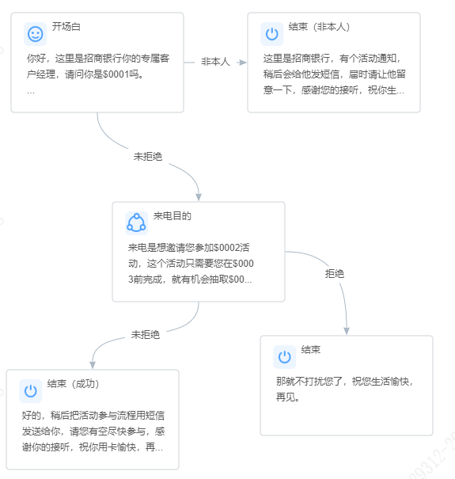

# sellbot

sellbot 是一个对话机器人，输入一段文本，机器人给出回复。

启动服务：

```bash
git clone https://github.com/zhongxic/sellbot.git

cd sellbot

go mod download

go run ./cmd/sellbot/main.go
```

指定配置文件启动：

```bash
go run ./cmd/sellbot/main.go --config ./config/config.yaml
```

配置文件内容：

```yaml
# 服务配置
server:
  # 启动端口默认为 8080
  port: 8080
# 日志配置
logging:
  level: debug
  file: log.log
  # 日志文件保留天数
  max-age: 7
  # 日志文件轮转大小单位 Mb
  max-size: 1024
# 话术配置
process:
  cache:
    # 话术缓存过期时间 ms
    expiration: 1800
    # 缓存清理时间间隔 ms
    cleanup-interval: 900
  directory:
    # 测试话术部署目录
    test: data/process/test/
    # 正式话术部署目录
    release: data/process/release/
# 分词器配置
tokenizer:
  # 额外词典文件路径
  # 可不做配置，默认使用内置词典，如果需要减少内存占用可配置一个较小的词典
  extra-dict: data/dict/dict.txt.small
  # 停用词词典路径，可不做配置
  stop-words-dict: data/dict/stop_words.txt
# 会话配置
session:
  # 会话存储的类型
  # 目前只支持 memory 即在内存中存储
  repository: memory
  # 会话的过期时间 ms
  expiration: 1800
```

## 接口文档

### 申请开场白

申请开场白即代表着一通会话的开始。该接口会加载话术、校验变量、初始化会话与分词器，并响应开始节点的回复文案。

请求接口：

```http
POST http://localhost:8080/prologue
Content-Type: application/json

{
  "processId": "sample",
  "variables": {
    "$0001": "张三",
    "$0002": "贷款送好礼",
    "$0003": "2025-01-31",
    "$0004": "2000"
  },
  "test": true
}
```

参数说明：

| 名称        | 类型      | 说明                  |
|-----------|---------|---------------------|
| processId | string  | 话术编号                |
| variables | object  | 任务变量（变量个数必须与话术变量一致） |
| test      | boolean | 是否是测试话术             |

接口响应：

```json
{
  "success": true,
  "errorCode": "",
  "errorMessage": "",
  "data": {
    "sessionId": "ece12ca4-2a9f-405b-be28-623aeb1a0a98",
    "hits": {
      "sentence": "",
      "segments": [],
      "hitPaths": [
        {
          "domain": "开场白",
          "branch": "enter",
          "matchedWords": []
        }
      ]
    },
    "answer": {
      "text": "你好，这里是招商银行你的专属客户经理，请问你是张三吗。",
      "audio": "1.wav",
      "ended": false,
      "agent": false
    },
    "intentions": [
      {
        "code": "T",
        "displayName": "default",
        "reason": "default intention"
      }
    ]
  }
}
```

响应说明：

| 字段                                     | 类型     | 说明         |
|----------------------------------------|--------|------------|
| sessionId                              | string | 当前会话 Id    |
| hits                                   | object | 命中信息       |
| &nbsp;&nbsp;- sentence                 | string | 客户文本       |
| &nbsp;&nbsp;- segments                 | array  | 分词结果       |
| &nbsp;&nbsp;- hitPaths                 | array  | 命中的分支和路径   |
| &nbsp;&nbsp;&nbsp;&nbsp;- domain       | string | 命中节点名称     |
| &nbsp;&nbsp;&nbsp;&nbsp;- branch       | string | 命中分支名称     |
| &nbsp;&nbsp;&nbsp;&nbsp;- matchedWords | array  | 匹配到的关键词    |
| answer                                 | object | 回复内容       |
| &nbsp;&nbsp;- text                     | string | 回复文本       |
| &nbsp;&nbsp;- audio                    | string | 回复音频文件名    |
| &nbsp;&nbsp;- ended                    | string | 本次交互后是否挂断  |
| &nbsp;&nbsp;- agent                    | string | 本次交互后是否转人工 |
| intentions                             | array  | 命中的意向标签    |
| &nbsp;&nbsp;- code                     | string | 意向标签编码     |
| &nbsp;&nbsp;- displayName              | string | 意向标签名称     |
| &nbsp;&nbsp;- reason                   | string | 命中该意向标签的原因 |

### 标记通话接听

该接口用于重置通话接听时间。一通电话在呼出之前，需要进行包括下载音频文件、初始化开场白等在内的一系列准备工作。在准备阶段，由于通话还没有接听，若以初始化开场白的时间作为接听时间，会导致与接听时长相关的意向标签分析不准确，因此需要重置通话接听时间。

请求接口：

```http
POST http://localhost:8080/connect
Content-Type: application/json

{
  "sessionId": "{{sessionId}}"
}
```

参数说明：

| 名称        | 类型     | 说明      |
|-----------|--------|---------|
| sessionId | string | 当前会话 Id |

接口响应：

同申请开场白接口。

### 对话接口

客户与机器人进行交互。

请求接口：

```http
POST http://localhost:8080/chat
Content-Type: application/json

{
  "sessionId": "{{sessionId}}",
  "sentence": "是的",
  "silence": false,
  "interruption": 0
}
```

参数说明：

| 名称           | 类型      | 说明                                       |
|--------------|---------|------------------------------------------|
| sessionId    | string  | 当前会话 Id                                  |
| sentence     | string  | 客户文本                                     |
| silence      | bool    | 是否静音                                     |
| interruption | integer | 打断类型（0-未打断 1-强打断 2-业务问打断 3-澄清打断 4-开场白打断） |

接口响应：

同申请开场白接口。

### 会话保持

该接口用于刷新会话的过期时间。当客户经理介入通话后，客户不再与机器人进行交互，但是此时还不能挂断机器人，否则机器人记录的接听时长与实际接听时长会不一致，导致与接听时长相关的意向标签分析不准确，因此需要将会话维持住，直到任意一方挂机。

请求接口：

```http
POST http://localhost:8080/hold
Content-Type: application/json

{
  "sessionId": "{{sessionId}}"
}
```

参数说明：

| 名称        | 类型     | 说明      |
|-----------|--------|---------|
| sessionId | string | 当前会话 Id |

接口响应：

同申请开场白接口。

### 挂断机器人

通话结束后挂断机器人。

请求接口：

```http
POST http://localhost:8080/hangup
Content-Type: application/json

{
  "sessionId": "{{sessionId}}"
}
```

参数说明：

| 名称        | 类型     | 说明      |
|-----------|--------|---------|
| sessionId | string | 当前会话 Id |

接口响应：

同申请开场白接口。

## 话术规范

话术是用于控制对话流程走向的 json 文件。一个话术由节点（domains）、话术设置（options）、意向标签（intentions）以及变量（variables）组成。查看[样例话术](./data/process/test/sample/sample.json)文件。

### 话术节点

节点即对话过程中的一个流程节点，节点具有分支，分支控制了流程的走向。如下图所示。



#### 定义分支

分支归属于一个节点，或回复文案或指向下一个节点：若分支的回复文案不为空，则响应分支的文案；若分支的回复文案为空，则直接跳转分支 next 属性指向的节点。

分支的结构：

```json
{
  "name": "enter",
  "semantic": "special",
  "order": 0,
  "keywords": {
    "simple": [],
    "combination": [],
    "exact": []
  },
  "responses": [
    {
      "text": "你好，这里是招商银行你的专属客户经理，请问你是$0001吗。",
      "audio": "1.wav",
      "enableAutoJump": false,
      "next": ""
    }
  ],
  "enableExceedJump": false,
  "next": ""
}
```

分支语义（semantic）：

| 语义       | 说明   |
|----------|------|
| positive | 肯定回答 |
| negative | 否定回答 |
| special  | 一般语义 |

分支的语义用于更新会话的状态信息。例如命中了 positive 分支，则会话的肯定回答次数增加、命中了 negative 分支，则会话的否定回答次数增加，命中 spacial 或其它分支则不做处理。

分支的匹配顺序（order）只对业务问答节点的分支生效，用于控制不同问题的匹配优先级。

分支的关键词（keywords）：

- simple：简单关键词。只要分词结果在关键词中则视为命中。
- combination：组合关键词。只有分词结果包含词组中的所有关键词时才视为命中。
- exact：完全匹配关键词。文本不能再分割且在完全匹配关键词中则视为命中。

分支超限跳转（enableExceedJump）：进入节点某个分支的次数大于该分支的文案数则发生超限。若此时分支开启了超限跳转，则跳转到 next 指向的节点；否则跳转通用对话 “结束_失败”。需要注意，主流程节点进入次数不受限制，因为一般是进入业务问答、通用对话，静音次数超限后跳转到主流程节点。

文案自动跳转 (responses[i].enableAutoJump)：如果文案开启了自动跳转，则不回复该文案，直接跳转文案 responses[i].next 指向的节点。

#### 定义节点

节点由分支（branches）、匹配优先级（matchOrders）、忽略配置（ignoreConfig），以及未匹配设置（missMatchConfig）组成。

节点的结构：

```json
{
  "name": "开场白",
  "type": "start",
  "category": "main_process",
  "order": 0,
  "branches": {
    "enter": {
      "name": "enter",
      "semantic": "special",
      "keywords": {
        "simple": [],
        "combination": [],
        "exact": []
      },
      "responses": [
        {
          "text": "你好，这里是招商银行你的专属客户经理，请问你是$0001吗。",
          "audio": "1.wav",
          "enableAutoJump": false,
          "next": ""
        }
      ],
      "enableExceedJump": false,
      "next": ""
    },
    "身份确认": {
      "name": "身份确认",
      "semantic": "positive",
      "keywords": {
        "simple": [
          "是的",
          "是我",
          "什么事情"
        ],
        "combination": [],
        "exact": []
      },
      "responses": [],
      "enableExceedJump": false,
      "next": "来电目的"
    }
  },
  "ignoreConfig": {
    "ignoreAny": false,
    "ignoreAnyExceptRefuse": false,
    "ignoreAnyExceptDomains": []
  },
  "missMatchConfig": {
    "longTextMissMatchJumpTo": "来电目的",
    "shortTextMissMatchJumpTo": ""
  }
}
```

节点的分类（category）：

| 类别            | 说明     |
|---------------|--------|
| main_process  | 主流程节点  |
| business_qa   | 业务问答节点 |
| common_dialog | 通用对话节点 |
| silence       | 静音节点   |

节点的类型（types）：

| 分类             | 说明          |
|----------------|-------------|
| start          | 开始节点        |
| normal         | 一般节点        |
| end            | 结束节点        |
| agent          | 转人工节点       |
| refused        | 通用对话-拒绝     |
| miss_match     | 通用对话-未识别    |
| end_fail       | 通用对话-结束_失败  |
| end_exceed     | 通用对话-结束_超限  |
| end_miss_match | 通用对话-结束_未匹配 |
| end_exception  | 通用对话-结束_出错  |
| clarification  | 通用对话-澄清打断   |

业务问答、通用对话，静音是全局生效的节点，处于任意一个主流程节点都可以匹配到。

话术必须有开始节点和结束节点。

话术只能具有一个业务问答节点，不同的问题属于业务问答节点不同的分支。

除业务问答外，其余节点必须要有 enter 分支。除结束节点外，其余主流程节点必须有且仅有一个未拒绝（positive）分支。主流程节点 enter 分支的回复文案即节点的文案，其它分支的回复文案必须为空，且分支的 next 属性指向下一个主流程节点。

节点的匹配顺序（order）：仅针对通用对话节点有效，控制不同通用对话匹配的优先级。

节点的分支匹配优先级（matchOrders）：定义当前节点同时命中多个分支时，优先匹配哪一个分支。当前节点分支匹配顺序由自定义优先级分支、通用对话的分支、当前节点的其它分支，业务问答分支的按顺序合并而来。

节点的忽略配置（ignoreConfig）：

- ignoreAny：忽略用户说话，直接走当前节点的未拒绝分支。
- ignoreAnyExceptRefuse：忽略用户说话除拒绝。除拒绝外，忽略用户说话，直接走当前节点的未拒绝分支。
- ignoreAnyExceptDomains：不可忽略的节点。除了配置的不可忽略的节点外，命中其它节点一律走当前节点的未拒绝分支。

节点的未匹配设置（missMatchConfig）：

- longTextMissMatchJumpTo：大于 4 个字且未匹配跳转的节点，为空则不跳转。
- shortTextMissMatchJumpTo：小于 4 个字且未匹配跳转的节点，为空则不跳转。

通用对话节点：

通用对话节点有 3 种行为：重复上一句（即跳转特殊节点 repeat）、回复指定文案，跳转指定节点。除了预定义的通用对话外，可以按照上述行为自定义通用对话。若自定义通用对话的节点类型以 end_ 作为前缀，那么将该节点视为具有结束含义的节点。

### 话术设置

话术设置结构：

```json
{
  "maxRounds": 12,
  "forceInterruptedJumpTo": "结束_失败"
}
```

其中 maxRounds 设置与机器人对话的最大轮次，超过最大对话轮次则机器人走通用对话 “结束_超限”。forceInterruptedJumpTo 设置在客户强制打断时需要跳转的节点。

### 意向标签

意向标签定义了默认的意向标签和意向规则。在交互过程中，机器人会根据意向规则判断是否命中某个意向标签，并将命中的标签输出。

意向标签结构：

```json
{
  "defaultIntention": "T",
  "intentionRules": [
    {
      "code": "F",
      "expression": "status.RefusedCount >= 1",
      "displayName": "客户拒绝",
      "reason": "(拒绝次数大于等于 1 次) 且 (处于'开场白'节点并命中关键词)",
      "intentionCondition": {
        "enabled": true,
        "domainName": "开场白",
        "keywords": {
          "simple": [
            "不参加"
          ],
          "combination": [],
          "exact": []
        }
      }
    }
  ]
}
```

意向规则 = 流程条件 + 意图条件。expression 是流程条件，它是一个 [expr](https://github.com/expr-lang/expr) 表达式，使用 expr 表达式并结合[会话状态信息 Status](./internal/service/process/env.go) 可以定义任意条件。intentionCondition 是意图条件，它由所处节点以及需要命中的关键词组成。

### 话术变量

话术具有的变量列表。申请开场白时，机器人会校验参数传递的变量数目是否与话术变量数目一致。回复文案时，会将文案中的变量替换成参数传递的变量值。

话术变量结构：

```json
[
  {
    "code": "$0001",
    "name": "客户姓名",
    "nickname": "cust_name"
  }
]
```
